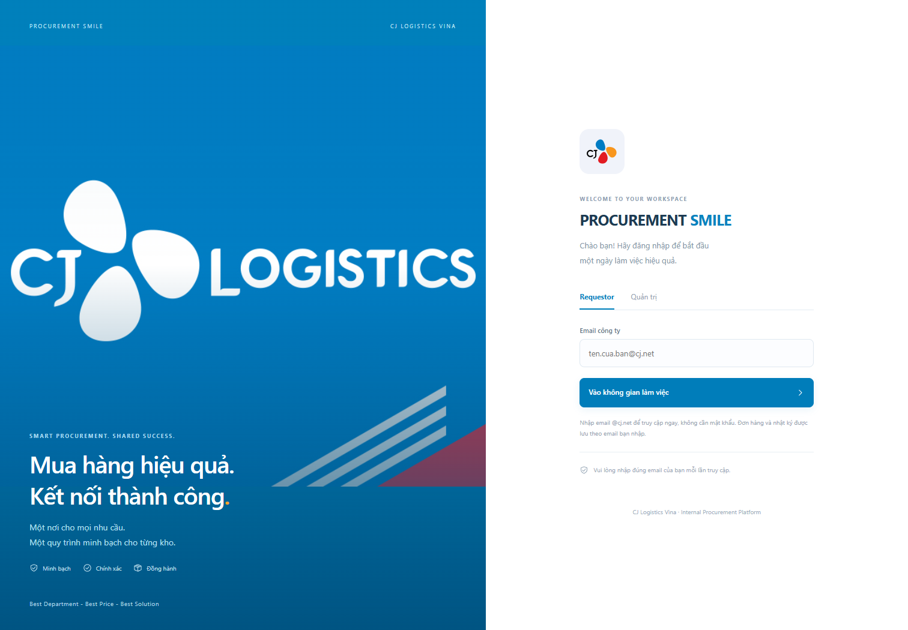
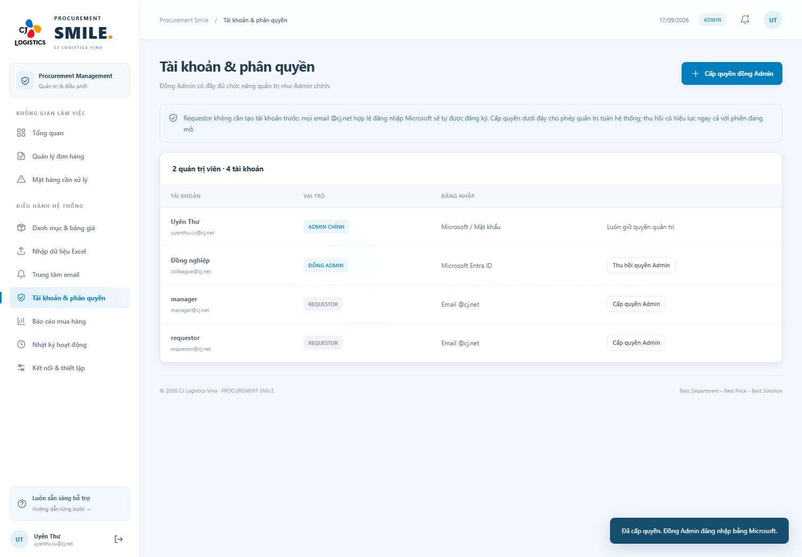
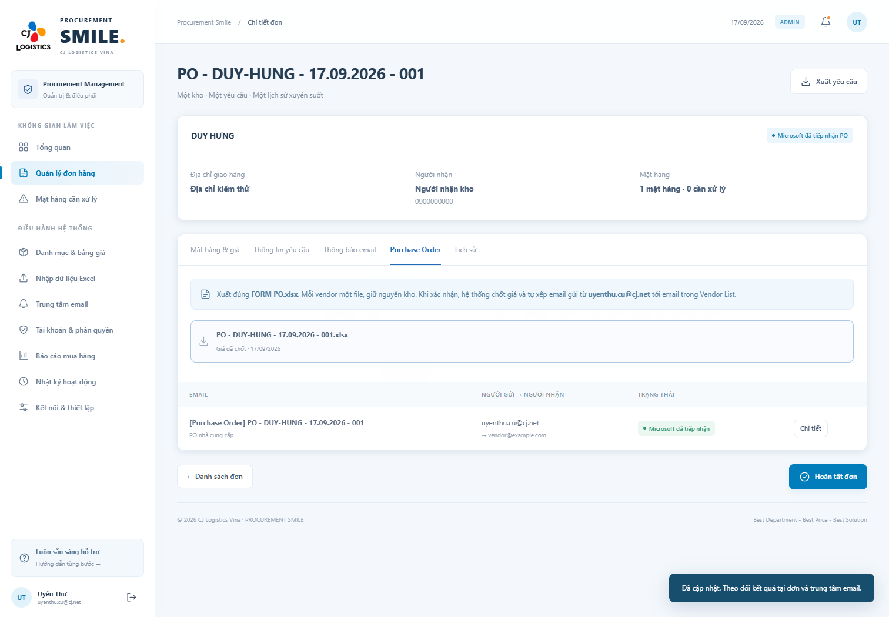

# PROCUREMENT SMILE · CJ Logistics Vina

**Best Department - Best Price - Best Solution**

**Gửi email qua Gmail trung gian:** dùng hộp thư có sẵn **prc.cjgmd@gmail.com**, làm theo [hướng dẫn kết nối Gmail](docs/GMAIL-SETUP.md). Cần nhập mật khẩu ứng dụng trên máy để bật gửi thật. Gmail là người gửi; email Requestor/Admin là Reply-To. Các hướng dẫn Graph dưới đây chỉ áp dụng khi chủ động chọn Microsoft.

Hướng dẫn từng bước cho người bắt đầu, cập nhật 18/09/2026.

**[Hướng dẫn công cụ mới: đối chiếu, so sánh giá, duyệt địa điểm, Tổng quan và format PO](docs/HUONG-DAN-CONG-CU-MOI.md)**.

> Requestor truy cập ngay bằng email @cj.net, không cần mật khẩu, Entra hoặc Microsoft. Email được chuẩn hóa chữ thường và dùng lại hồ sơ, đơn hàng, nhật ký qua các lần đăng nhập. Hệ thống không xác minh chủ email: ai nhập cùng email sẽ truy cập cùng hồ sơ. Admin chính vẫn đăng nhập bằng mật khẩu; gửi email thật và đăng nhập Microsoft của đồng Admin là các chức năng riêng cần cấu hình IT.

## 1. Mở website trên máy hiện tại

1. Mở Chrome hoặc Edge, nhập **http://127.0.0.1:3000**.
2. Nếu trang chưa chạy, nhấn **Windows + E**, mở `D:\ThuCNU\CODE\cj-purchase-ordering`.
3. Nhấp đúp **START-WEBSITE.cmd**, giữ cửa sổ dòng lệnh mở.
4. Quay lại trình duyệt, tải lại trang.
5. Chọn tab **Quản trị**.
6. Email: **uyenthu.cu@cj.net**.
7. Nhập **mật khẩu bạn đã yêu cầu thiết lập**, chọn **Đăng nhập quản trị**.

Tài khoản đã được khởi tạo và kiểm tra. Mật khẩu lưu dưới dạng scrypt hash trong SQLite, không nằm trong giao diện/README. Giá trị khởi tạo trong `.env` đã được xóa sau khi xác minh thành công. Tài khoản demo `@cj.local` của phiên bản 1 đã bị vô hiệu hóa.



Không mở `public/index.html` trực tiếp: website cần máy chủ API. Dừng máy chủ bằng **Ctrl + C** trong Terminal; dữ liệu đã lưu vẫn còn.

## 2. Dữ liệu đã nạp và việc cần hoàn thiện

| File người dùng cung cấp | Kết quả |
|---|---|
| WH List.xlsx | 16 kho; cả 16 chưa có Mail Line Manager |
| Vendor List.xlsx | 11 vendor; cả 11 chưa có Mail |
| Items list.xlsx | 374 sản phẩm chuẩn từ 375 dòng, 375 giá chờ xác nhận |
| FORM PO.xlsx | Dùng đúng workbook làm template PO |
| Ordering template.xlsx | Dùng đúng mẫu để tải/đọc/xuất yêu cầu |
| Các hình ảnh CJ | Dùng cho logo, icon, login và nền mờ workspace |

Items list không có VAT/ngày hiệu lực, 30 dòng chưa xác định được vendor. Đơn giá gốc được giữ, không tự giả định thuế. Một sản phẩm trùng tên/ĐVT dùng chung mã, nên 375 dòng tạo 374 sản phẩm.

Thứ tự chuẩn bị:

1. Requestor có thể đăng nhập ngay, không cần IT cấu hình. Chỉ khi cần gửi email thật/SSO cho đồng Admin, IT làm theo **[Microsoft 365 Setup](docs/MICROSOFT-365-SETUP.md)**.
2. Admin điền email Line Manager cho từng kho.
3. Điền email nhận PO của từng vendor.
4. Hoàn thiện địa chỉ/người nhận/số điện thoại kho còn thiếu.
5. Xác nhận vendor, VAT, ngày hiệu lực của giá cần sử dụng; chuyển thành ACTIVE.
6. Thử quy trình với các mailbox đã được cho phép trước khi dùng đại trà.

Menu **Kết nối & thiết lập** hiển thị rõ các mục còn thiếu.

## 3. Quyền truy cập

| Vai trò | Cách đăng nhập | Quyền |
|---|---|---|
| Requestor | Chỉ nhập email @cj.net | Tạo/sửa nháp và xem đơn của chính mình; không xem giá |
| Line Manager | Không cần truy cập website để nhận thông báo | Chỉ nhận email khi Requestor chọn gửi; không có chức năng duyệt |
| Admin chính | uyenthu.cu@cj.net + mật khẩu đã thiết lập; hoặc Microsoft | Toàn quyền xử lý, xem giá, phát hành PO, quản trị tài khoản |
| Đồng Admin | Microsoft, email @cj.net được cấp quyền | Đầy đủ chức năng quản trị như Admin chính; không tạo đơn |

Requestor không cần được tạo tài khoản trước. Nhập email lần đầu tự tạo hồ sơ; những lần sau nhập cùng email để mở lại đơn cũ. Khoảng trắng đầu/cuối được bỏ và chữ hoa/thường được coi là cùng email. Trang “Nhật ký của tôi” hiển thị hoạt động của email hiện tại. Tài khoản Admin không được truy cập bằng cách chỉ nhập email; phiên Requestor phải đăng nhập quản trị lại nếu được cấp quyền Admin.

Requestor thay ID trong URL cũng không truy cập được đơn của người khác. Email Line Manager không cấp quyền xem đơn của người khác trên website.

Admin chính luôn giữ quyền quản trị. Mọi Admin có thể cấp/thu hồi đồng Admin; không tự thu hồi quyền của phiên đang dùng và không xóa quyền Admin chính. Thu hồi có tác dụng ngay ở API kế tiếp.

## 4. Cấp đồng Admin

1. Admin mở **Tài khoản & phân quyền**.
2. Bấm **Cấp quyền đồng Admin**.
3. Nhập email @cj.net và tên hiển thị.
4. Đọc phạm vi quyền, chọn **Xác nhận cấp quyền**.
5. Người đó đăng nhập bằng tab **Quản trị → Admin đăng nhập Microsoft**.
6. Muốn thu hồi: chọn đúng dòng → **Thu hồi quyền Admin**, xác nhận. Tài khoản trở về Requestor và chỉ xem đơn của mình.

Không chia sẻ mật khẩu Admin chính cho đồng Admin. Đồng Admin dùng Microsoft cá nhân, không cần mật khẩu website riêng.



## 5. Khai báo tuyến Line Manager và vendor

1. Admin vào **Danh mục & bảng giá → Kho hàng**.
2. Tìm kho → **Sửa**.
3. Điền **Email Line Manager (@cj.net)**, kiểm tra địa chỉ/người nhận/SĐT.
4. **Lưu dữ liệu**.
5. Mở tab **Nhà cung cấp** → tìm vendor → **Sửa**.
6. Điền email đúng trong trường **Email**, lưu lại. Vendor được dùng email ngoài @cj.net.

Mỗi đơn lưu lựa chọn gửi, email Line Manager và người nhận bổ sung tại lúc xác nhận. Email thông báo không chứa giá.

Nếu đã chọn gửi nhưng kho thiếu email manager: đơn vẫn chuyển tới Admin; thư chờ dữ liệu. Admin bổ sung email tại Kho hàng, vào **Trung tâm email → Chi tiết → Kiểm tra và gửi lại**. Thư đã được Microsoft tiếp nhận không được gửi lại.

## 6. Requestor tạo yêu cầu thủ công

1. Trang đăng nhập → **Requestor** → nhập email @cj.net → **Vào không gian làm việc**.
2. Hệ thống mở ngay không gian làm việc, không yêu cầu mật khẩu hoặc Microsoft.
3. **Không gian của bạn → Tạo yêu cầu mới**.
4. Chọn **Phòng Ban / Địa điểm nhận hàng**. Các kho có sẵn tự xuất hiện tại đây; không cần chọn kho lần nữa. Kiểm tra thông tin nhận hàng.
5. Nhập ngày mong muốn nhận hàng, nội dung đơn hàng và ghi chú yêu cầu, chọn **Tiếp tục**.
6. Tab **Nhập thủ công**: nhập tên mặt hàng, đơn vị và số lượng lớn hơn 0. NCC có thể để Chưa xác định để Admin so sánh và chọn báo giá.
7. Bấm **Thêm mặt hàng** để có thêm dòng.
8. **Kiểm tra dữ liệu**.
9. Xanh = khớp; vàng = cần đối chiếu; đỏ = thiếu master/giá. Dòng đỏ vẫn được gửi khi tên/ĐVT/số lượng hợp lệ.
10. **Lưu bản nháp** để sửa sau hoặc **Gửi yêu cầu**, xác nhận.
11. Trong hộp xác nhận, chọn **Tôi xác nhận gửi email thông báo đơn hàng** nếu cần gửi. Có thể nhập email bổ sung, ví dụ `a@cj.net;b@example.com`. Không chọn thì không tạo email thông báo.
12. Bấm **Xác nhận**. Đơn chuyển **Đã xác nhận · Chờ tiếp nhận** cho Admin ngay. Nếu chọn gửi, hệ thống xếp email từ Requestor tới Line Manager, các Admin đang hoạt động và người nhận bổ sung. Email trùng được loại bỏ.
13. Xem chi tiết → **Thông báo email** để biết lựa chọn gửi và trạng thái email. Kho/mặt hàng đã khóa sau khi xác nhận.

Requestor chỉ thấy đơn của mình trong **Đơn hàng của tôi**, không nhận giá/VAT/tổng tiền/PO vendor từ API.

## 7. Requestor nhập Excel

1. Tạo yêu cầu, chọn Phòng Ban/địa điểm, nhập ngày nhận và nội dung, bấm Tiếp tục → **Tải lên Excel**.
2. Bấm **Tải mẫu cho [kho]**. File dùng đúng Ordering Template, điền sẵn B4 và không còn mặt hàng ví dụ.
3. Mở Excel, điền:
   - B1: nội dung yêu cầu.
   - B2: bộ phận sử dụng.
   - B3: mục đích sử dụng.
   - B4: mã kho, phải đúng kho đã chọn.
   - Dòng 5: giữ tiêu đề cột.
   - Từ dòng 6: STT, NHÀ CUNG CẤP, NỘI DUNG HÀNG HÓA, ĐVT, SỐ LƯỢNG, GHI CHÚ.
4. NCC có thể là mã, tên đầy đủ hoặc Alias đúng trong Vendor List, ví dụ `Anh Phước`.
5. STT được dùng công thức ROW của mẫu; các cột nghiệp vụ khác phải là giá trị, không công thức.
6. Mỗi file một sheet và một kho. Không để dòng trống xen giữa mặt hàng.
7. Lưu `.xlsx`, quay lại website, chọn/kéo thả file.
8. **Kiểm tra dữ liệu**. Sửa theo thông báo dòng/cột/vấn đề/cách sửa nếu có; lưu và chọn lại file.
9. Xem trước rồi lưu nháp/gửi.

Mẫu phẳng v1 Warehouse/Supplier/Item/UOM/Quantity vẫn đọc được. File gốc chưa ghi kho B4 áp dụng cho kho Requestor chọn; mẫu tải mới luôn có B4. Giới hạn 5 MB, 2.000 dòng, `.xlsx` hoặc CSV UTF-8 cho mẫu phẳng, không `.xls`.

Sửa nháp Excel bằng chế độ thủ công chuyển nguồn thành MANUAL và thay nội dung đính kèm cũ. Đơn đã gửi không được sửa kiểu này.

## 8. Line Manager nhận thông báo

Line Manager chỉ nhận email đơn hàng, không có màn hình hoặc API phê duyệt trên website. Email gồm kho, Requestor, mặt hàng, đơn vị tính, số lượng và ghi chú; không có nút duyệt/từ chối và không có giá.

Nếu không chọn gửi, Requestor vẫn xác nhận đơn bình thường và Admin nhận thông báo trong website. Nếu chọn gửi nhưng thiếu cấu hình mail hoặc email manager, chỉ email chờ xử lý; đơn không bị chặn.

Đơn cũ đang chờ Line Manager được chuyển sang chờ Admin khi khởi động bản mới. Hàng đợi thư yêu cầu duyệt cũ chưa gửi được hủy; thư đã gửi và nhật ký lịch sử được giữ lại.

## 9. Admin xử lý, xuất PO và gửi vendor

1. **Quản lý đơn hàng** → mở đơn Requestor đã xác nhận.
2. **Tiếp nhận xử lý**.
3. Kiểm tra **Mặt hàng & giá**; mở **Đối chiếu / Báo giá** để tìm sản phẩm/NCC hoặc tạo nhanh sản phẩm và giá còn thiếu.
4. So sánh báo giá theo tổng gồm VAT, tích NCC phù hợp, nhập lý do và bấm **Áp dụng sản phẩm & nhà cung cấp**. Có thể ghi nhớ tên thay thế.
5. Giá phải ACTIVE, đúng sản phẩm/NCC/ĐVT, có VAT và đang hiệu lực. Không có hai khoảng giá ACTIVE chồng nhau.
6. Kiểm tra địa chỉ/người nhận/SĐT; nếu cần dùng **Thông tin nhận hàng** để bổ sung. Thay đổi lưu audit, không đổi kho.
7. Kiểm tra email từng vendor.
8. **Xác nhận đủ dữ liệu** → **Kiểm tra & phát hành PO**.
9. Trong Purchase Order, chọn **Xác nhận, tạo PO & gửi NCC**, đọc xác nhận rồi đồng ý.
10. Hệ thống chốt giá/VAT, điền đúng FORM PO, tách mỗi vendor một file, xếp email từ **Admin xác nhận** tới **email vendor** và đính kèm đúng file đó.
11. Nếu trên 5 mặt hàng, hệ thống thêm dòng và dịch vùng tổng/ghi chú/chữ ký, giữ định dạng mẫu.
12. Xem tab PO hoặc **Trung tâm email**.
13. Khi máy chủ email nhận đủ email PO, trạng thái tự thành **Máy chủ email đã tiếp nhận PO**.
14. Khi hoàn tất công việc thực tế, bấm **Hoàn tất đơn**.

Không đánh dấu gửi thủ công. Graph trả 202 chỉ có nghĩa Microsoft nhận yêu cầu gửi, chưa bảo đảm người nhận đã nhận/đọc. Kiểm tra Sent Items/message trace khi cần. Giá/file đã phát hành không đổi khi sửa master.



## 10. Mã đơn và tên file

```text
PO-SÓNG THẦN CHUNG-18.09.2026-001
PO-SÓNG THẦN CHUNG-18.09.2026-002
```

- Format: **PO-TÊN PHÒNG BAN-DD.MM.YYYY-001**. Phòng ban/kho là địa điểm nhận hàng; tên viết hoa và giữ dấu tiếng Việt, loại ký tự không hợp lệ trong tên file.
- Ngày tính theo **Asia/Ho_Chi_Minh**, năm bốn chữ số YYYY.
- Hậu tố 001/002 tăng riêng từng kho/ngày, cấp trong transaction, có UNIQUE ở DB để chống trùng.
- Cấp mã khi lưu đơn đầu tiên. Đổi kho của nháp cấp mã mới đúng kho; số cũ không tái sử dụng. Xác nhận muộn không đổi ngày cấp mã.
- Đơn hủy không tái sử dụng số. Khoảng trống thứ tự là bình thường.
- Một vendor: `[Mã đơn].xlsx`.
- Nhiều vendor: `[Mã đơn] - [Mã NCC].xlsx` để phân biệt file.
- Đơn v1 giữ nguyên mã lịch sử, không thay hồi tố.

## 11. Xử lý email lỗi

| Trạng thái | Ý nghĩa và cách xử lý |
|---|---|
| Chờ gửi | Queue đã lưu; chờ worker |
| Thiếu email | Bổ sung email manager rồi gửi lại từ Trung tâm email |
| Chờ cấu hình gửi mail | Tạo Gmail rồi chạy SETUP-GMAIL.cmd; xem hướng dẫn Gmail |
| Đang gửi | Không gửi lại |
| Microsoft đã tiếp nhận | Graph trả 202; xem Microsoft để xác minh delivery |
| Gửi thất bại | Sửa nguyên nhân rồi retry thủ công |
| Cần kiểm tra Sent Items | Chưa rõ đã gửi chưa; kiểm tra hộp thư trước khi retry |
| Đã hủy | Không gửi lại |

Vào **Trung tâm email → Chi tiết** để xem sender, recipient, lỗi và nội dung. Thư ACCEPTED không có retry thông thường. Thư UNKNOWN không tự retry để tránh trùng; Admin phải xác nhận đã kiểm tra Sent Items.

Trước khi IT bật MAIL_ENABLED=true, rà soát/hủy đơn thử không muốn gửi: QUEUED/BLOCKED_CONFIG sẽ được xử lý khi bật mail.

## 12. Nhập/cập nhật danh mục Excel

1. **Nhập dữ liệu Excel** → chọn loại danh mục.
2. Tải Excel danh mục hiện tại để lấy đúng mã/cột, hoặc dùng trực tiếp WH List/Vendor List đã bổ sung email.
3. Chọn file → **Đọc file & ánh xạ cột**.
4. WH List/Vendor List được gợi ý mapping tiếng Việt/Anh. Nếu không có mã, hệ thống tra theo tên cũ hoặc tạo mã ổn định từ tên kho/Alias vendor.
5. Kiểm tra mapping, chọn **Kiểm tra bản xem trước**.
6. Xem số dòng mới/cập nhật/trùng/lỗi. Sửa hết lỗi trước khi xác nhận.
7. **Xác nhận nhập**. Nếu có xung đột, toàn bộ batch không lưu dở dang.
8. Xem Lịch sử nhập và Nhật ký hoạt động.

Không đổi tên/Alias tùy tiện khi muốn cập nhật bản ghi không có mã. Khuyến nghị xuất master hiện tại để cập nhật theo code. Ngừng dùng bản ghi bằng INACTIVE, không xóa cứng. Items list đã được nạp một lần khi nâng cấp; để cập nhật giá hàng loạt, xuất Bảng giá, điền VAT/hiệu lực/vendor rồi nhập lại theo code.

## 13. Cài từ số 0 trên máy khác

1. Cài **Node.js 24 LTS**, từ 24.14.0 tương thích, tại `https://nodejs.org/`, giữ tùy chọn PATH.
2. Cài **Visual Studio Code** tại `https://code.visualstudio.com/` nếu chưa có.
3. Sao chép thư mục `cj-purchase-ordering`. Không công khai DB/.env có dữ liệu thật.
4. VS Code → **File → Open Folder** → chọn dự án.
5. **Terminal → New Terminal**.
6. Chạy lần lượt:

```powershell
node --version
npm.cmd --version
npm.cmd ci
```

7. Nếu chưa có `.env`, chạy `Copy-Item .env.example .env`.
8. Nếu DB mới hoàn toàn, đặt BOOTSTRAP_ADMIN_PASSWORD trước lần chạy đầu. Nếu dùng DB đã bàn giao, không cần đặt lại.
9. Điền Entra theo tài liệu IT; để MAIL_ENABLED=false đến khi nghiệm thu.
10. Chạy `npm.cmd start`, mở APP_URL trong trình duyệt.
11. Dùng đúng hostname/cổng APP_URL; không trộn `localhost` và `127.0.0.1` khi đăng nhập/gửi biểu mẫu.
12. Dừng bằng Ctrl + C; mở lại bằng `npm.cmd start` hoặc START-WEBSITE.cmd.

Máy hiện tại có Node portable trong `.tools/node-v24.14.0-win-x64`, file START-WEBSITE tự dùng. Chuyển sang máy khác không có `.tools` thì cài Node như trên.

## 14. Sao lưu và khôi phục

- Dừng website trước khi copy toàn bộ `data`; sao lưu `.env` an toàn và `templates`.
- Không chỉ copy một file sqlite khi đang chạy vì SQLite dùng WAL.
- Nâng cấp đã tạo backup nhất quán tại `data/backups/before-v2-*.sqlite` bằng VACUUM INTO.
- Giữ nguyên 6 đơn cũ và mã lịch sử. Tài khoản demo bị vô hiệu hóa, master demo v1 chuyển INACTIVE.
- Khôi phục: dừng máy chủ, lưu bản sao dữ liệu hiện tại, thay bằng backup rồi chạy lại.
- Không sửa DB để thay PO đã gửi. Sau restart phải đăng nhập lại vì session ở bộ nhớ.

## 15. Kiểm thử và cấu trúc

Chạy `npm.cmd test`. Test dùng DB kiểm thử và Microsoft/mail giả lập, không gửi thư thật. Xem **[Kết quả công cụ mới](docs/KIEM-THU-CONG-CU-MOI.md)**.

```text
public/app.js          Tạo yêu cầu, danh mục, nhập Excel, báo cáo
public/v2.js           Đăng nhập, workspace, thông báo, quyền và email
public/brand.css       Nhận diện CJ, responsive
public/assets/         Hình ảnh CJ đã cung cấp
server.js             API, xác thực, workflow, worker
lib/identity.js        Microsoft MSAL và tài khoản
lib/mail.js            Microsoft Graph, outbox và retry
lib/company-data.js    Nạp master một lần, mã đơn kho/ngày
lib/master-import.js   Mapping WH List/Vendor List
lib/excel.js           Ordering Template và FORM PO thật
lib/database.js        SQLite, migration, password hash
lib/business.js        Validation, matching, Requestor-safe fields
templates/             Workbook mẫu và danh mục nguồn
test/                  Kiểm thử nghiệp vụ v2
docs/                  Hướng dẫn IT, mapping, nghiệm thu
```

## 16. Lỗi thường gặp

| Hiện tượng | Cách xử lý |
|---|---|
| Nút Microsoft chưa bật | Điền ENTRA_*, đăng ký callback, restart |
| Admin chính không vào được | Đúng tab/email/mật khẩu; sửa BOOTSTRAP sau khi có DB không đổi mật khẩu cũ |
| npm.ps1 bị chặn | Dùng npm.cmd, không cần hạ chính sách PowerShell |
| Thiếu thư viện | npm.cmd ci trong đúng thư mục |
| Cổng 3000 đã dùng | Dừng server cũ hoặc đổi PORT/APP_URL và callback Entra đồng nhất |
| Origin không hợp lệ | Truy cập đúng hostname/cổng APP_URL |
| Kho trong Excel khác | B4 đúng kho; tách file theo kho |
| Manager không thấy đơn của Requestor | Đúng thiết kế: manager chỉ nhận email, không có quyền xem/duyệt đơn người khác |
| Chưa đủ dữ liệu tạo PO | Kiểm tra vendor/email/VAT/hiệu lực và thông tin nhận hàng |
| Có PO nhưng email chưa gửi | Xem Trung tâm email; không tạo PO lại |
| Dữ liệu vừa đổi ở tab khác | Tải lại bằng Ctrl + R |

## 17. Trước khi dùng thật

Cần IT kiểm tra SSO/Mail.Send trên tenant thật, hostname HTTPS và mailbox được ủy quyền; kiểm tra FORM PO bằng Microsoft Excel và người phụ trách mua hàng. Không thể xác nhận dịch vụ tenant thật khi chưa có cấu hình Entra trong môi trường này.

Bản này chạy một Node/SQLite instance. Chưa có amendment/revision PO đã gửi, delivery/read tracking, đa tiền tệ hoặc đổi mật khẩu Admin trên giao diện. Xem **[Phạm vi và UAT v2](docs/PHAM-VI-VA-UAT-V2.md)**. Hướng dẫn v1 được lưu tại docs/README-v1-ARCHIVE.md chỉ để tham khảo lịch sử.
