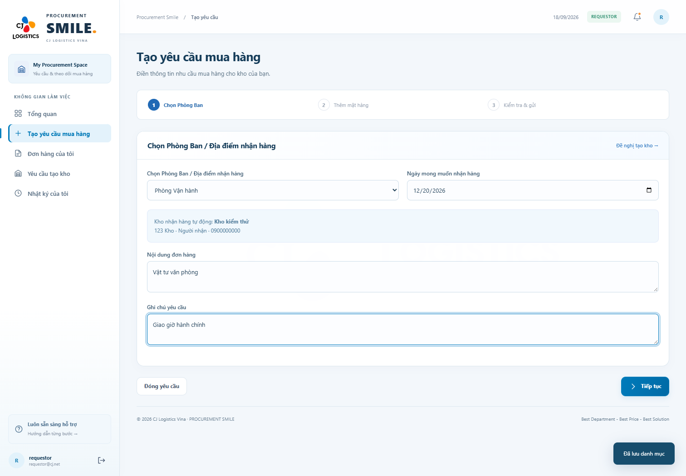
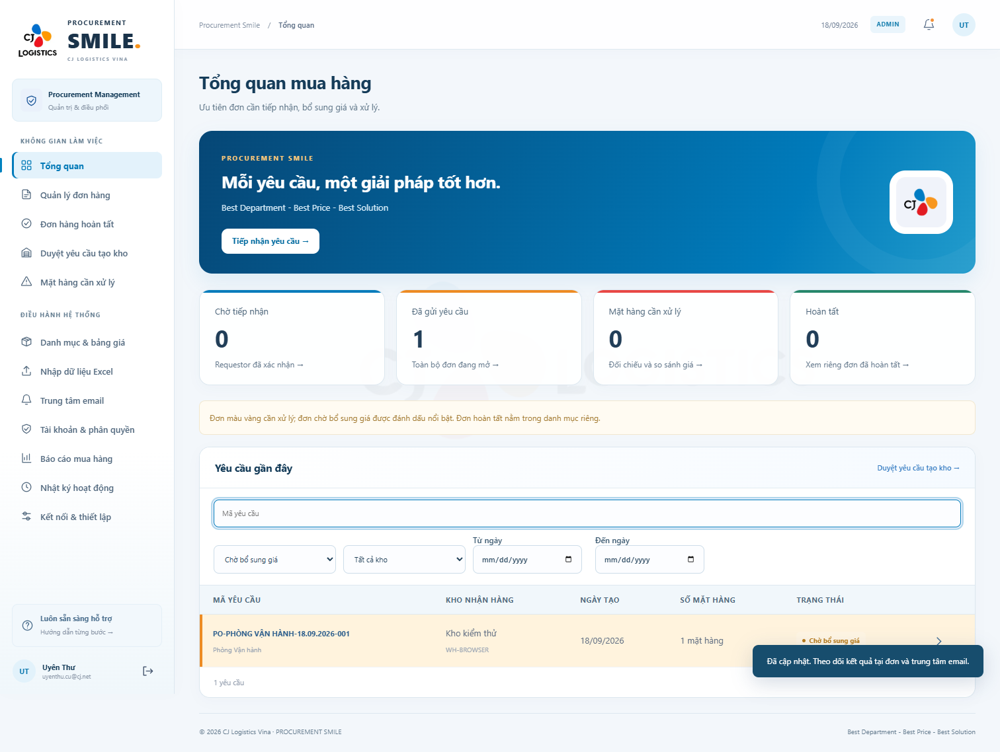
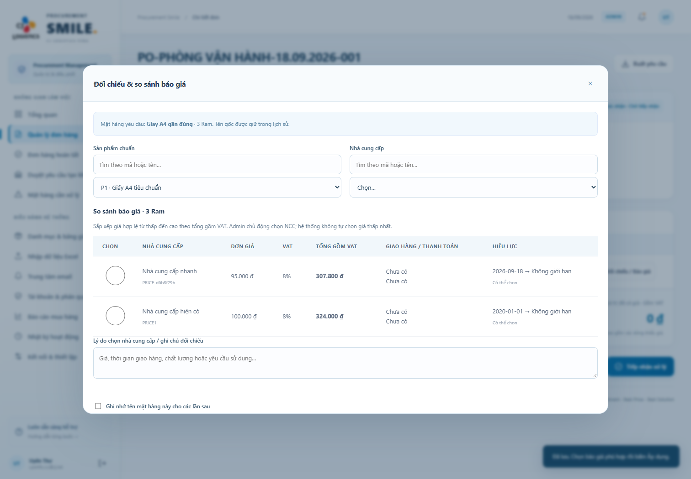

# Hướng dẫn công cụ mua hàng mới — 18/09/2026

## 1. Phòng Ban / Địa điểm nhận hàng

Kho và phòng ban đều được dùng như địa điểm nhận hàng. Website tự đưa kho có sẵn vào lựa chọn **Chọn Phòng Ban / Địa điểm nhận hàng**, sử dụng cùng kho để lấy địa chỉ giao hàng, người nhận, Line Manager và mã PO. Không cần Requestor chọn thêm một kho nữa.

1. Đăng nhập bằng email @cj.net.
2. Chọn **Tạo yêu cầu mua hàng**.
3. Chọn **Phòng Ban / Địa điểm nhận hàng**. Kiểm tra thông tin nhận hàng tự hiển thị.
4. Điền **Ngày mong muốn nhận hàng**, **Nội dung đơn hàng** và **Ghi chú yêu cầu**. Ngày và nội dung là bắt buộc.
5. Bấm **Tiếp tục**, nhập mặt hàng hoặc tải Excel. Nhà cung cấp được để **Chưa xác định**.
6. Kiểm tra và gửi. Đơn chuyển thẳng tới Admin; email thông báo Line Manager vẫn chỉ gửi nếu bạn tích chọn.

Thông tin phòng ban, ngày nhận, nội dung và ghi chú trên màn hình được giữ khi tải Excel. B4 trong Excel vẫn là mã kho/địa điểm liên kết; không thay B4 bằng tên phòng ban.



## 2. Đề nghị tạo địa điểm mới

Requestor:

1. Chọn **Yêu cầu tạo kho → Đề nghị tạo kho**.
2. Nhập tên địa điểm, địa chỉ, người nhận, số điện thoại và email Line Manager @cj.net. Email người nhận là tùy chọn.
3. Bấm **Gửi đề nghị tạo kho**.
4. Theo dõi trạng thái và ý kiến Admin trên danh sách của mình. Địa điểm chờ duyệt chưa được chọn để đặt hàng.

Admin:

1. Chọn **Duyệt yêu cầu tạo kho → Xem & xử lý**.
2. Kiểm tra/sửa thông tin.
3. Chọn **Duyệt & kích hoạt kho**, hoặc nhập lý do rồi **Từ chối**.
4. Khi được duyệt, địa điểm thành ACTIVE và tự xuất hiện ở lựa chọn Phòng Ban. Requestor tải lại trang để cập nhật danh sách.

Danh mục **Kho hàng** quản lý địa chỉ/Line Manager. Danh mục **Phòng ban** hiển thị liên kết địa điểm; hệ thống tự tạo liên kết cho các kho có sẵn. Chỉ các phòng ban ACTIVE có kho liên kết ACTIVE được sử dụng.

## 3. Tổng quan của Admin

| Ô chức năng | Khi bấm |
|---|---|
| Chờ tiếp nhận | Đơn Requestor đã xác nhận, Admin chưa tiếp nhận |
| Đã gửi yêu cầu | Toàn bộ đơn đang mở, không gồm nháp/hủy/từ chối/hoàn tất |
| Mặt hàng cần xử lý | Những dòng cần đối chiếu hoặc bổ sung giá |
| Hoàn tất | Danh sách đơn hoàn tất riêng |

**Yêu cầu gần đây** không hiển thị đơn hoàn tất. Có bộ lọc mã yêu cầu, trạng thái, kho nhận hàng, ngày tạo từ/đến (giờ Việt Nam). Các bộ lọc dùng kết hợp. Đơn chờ giá và dòng cần xử lý được tô nổi bật; đơn chờ giá được ưu tiên lên đầu.



## 4. Đối chiếu mặt hàng gần đúng

1. Mở đơn → **Mặt hàng & giá** → **Đối chiếu / Báo giá** ở dòng cần xử lý.
2. Gõ tên hoặc mã vào ô **Tìm Sản phẩm chuẩn**, sau đó chọn sản phẩm trong danh sách xổ xuống. Tìm kiếm bỏ qua dấu tiếng Việt và hoa/thường.
3. Chỉ đối chiếu sản phẩm cùng đơn vị tính để tránh nhầm giá theo thùng/hộp/cái.
4. Tìm NCC bằng ô tìm tương tự, hoặc tích chọn báo giá trong bảng để chọn NCC tự động.
5. Ghi lý do chọn; nếu cần, tích ghi nhớ tên mặt hàng cho lần sau.
6. Bấm **Áp dụng sản phẩm & nhà cung cấp**. Tên Requestor nhập ban đầu vẫn được giữ.

## 5. Tạo sản phẩm và nhập giá ngay trong đơn

1. Trong cửa sổ đối chiếu, mở **Tạo nhanh sản phẩm / nhà cung cấp / báo giá**.
2. Với hàng mới, tích **Mặt hàng mới**, điền tên và nhóm. Mã sản phẩm có thể để trống để hệ thống tạo; ĐVT lấy từ dòng yêu cầu.
3. Chọn NCC ở trên. Nếu NCC mới, tích **Thêm nhà cung cấp mới**, nhập tên, email nhận PO, liên hệ, điện thoại, điều kiện giao hàng/thanh toán và bảo hành nếu có.
4. Tích **Nhập báo giá ngay**, nhập đơn giá VND, VAT, hiệu lực từ/đến và số báo giá nếu có. Không tự mặc định VAT.
5. Bấm **Lưu sản phẩm / báo giá**. Nếu dữ liệu sai, toàn bộ thao tác này được hoàn tác; không để lại sản phẩm/NCC lưu dở.
6. Giá được lưu trong bảng giá dùng chung và xuất hiện ngay trong bảng so sánh. Chọn giá phù hợp rồi bấm **Áp dụng**.

Có thể bỏ tích nhập giá để chỉ tạo sản phẩm trước. Giá ACTIVE trùng khoảng hiệu lực của cùng sản phẩm/NCC/ĐVT bị từ chối; hãy sửa bảng giá hiện có thay vì tạo chồng giá.

## 6. So sánh báo giá và chọn NCC

Chọn sản phẩm chuẩn để xem báo giá của các NCC cho mặt hàng đó. Với mặt hàng mới, tạo sản phẩm trước hoặc cùng lúc nhập báo giá đầu tiên; sau đó nhập thêm các NCC để so sánh.

Bảng hiển thị đơn giá, VAT, tổng tiền theo số lượng gồm VAT, giao hàng/thanh toán và khoảng hiệu lực. Giá hợp lệ sắp từ thấp đến cao; **hệ thống không tự chọn NCC rẻ nhất**. Admin có thể chọn NCC giao sớm, phù hợp chất lượng hoặc nhu cầu và lưu lý do lựa chọn.

Báo giá hết hiệu lực, chưa đủ dữ liệu hoặc NCC ngừng hoạt động không được tích chọn. Sau khi chọn và áp dụng, tiếp tục xác nhận đủ dữ liệu rồi phát hành PO. PO lấy đúng giá và NCC đã chọn, giữ nguyên quy tắc tách một vendor một file.

Nếu nút chọn báo giá bị khóa, xem lý do ngay tại dòng (thiếu VAT, thiếu ngày hiệu lực, chưa ACTIVE…). Bấm **Bổ sung / sửa báo giá**, nhập VAT và ngày hiệu lực theo báo giá thực tế, rồi **Lưu & quay lại chọn báo giá**. Thao tác cập nhật đúng bản ghi giá hiện có thành ACTIVE, không tạo giá trùng. Sau đó tích NCC và **Áp dụng sản phẩm & nhà cung cấp**. Khi VAT còn thiếu, hệ thống không hiển thị tổng gồm VAT.



## 7. Bảng giá

Các cột theo thứ tự: **Mã sản phẩm, Mã nhà cung cấp, Đơn vị tính, Đơn giá (VND), VAT (%), Tiền tệ, Hiệu lực từ, Hiệu lực đến, Trạng thái**.

1. Vào **Danh mục & bảng giá → Bảng giá**, tìm dòng và bấm **Sửa**.
2. **Mã nhà cung cấp** là danh sách xổ chọn có cả mã và tên. Mã sản phẩm cũng có danh sách chọn.
3. Sửa các trường cần thiết rồi **Lưu dữ liệu**. Mã bản ghi giá vẫn giữ nội bộ để cập nhật đúng dòng; các PO đã phát hành giữ nguyên giá chốt.

## 8. Mã PO và tên file thống nhất

```text
PO-TÊN PHÒNG BAN-DD.MM.YYYY-001
PO-TÊN PHÒNG BAN-DD.MM.YYYY-002

Ví dụ: PO-SÓNG THẦN CHUNG-18.09.2026-001.xlsx
```

Tên phòng ban/địa điểm viết hoa, giữ dấu tiếng Việt. Ký tự không dùng được trong tên file được thay bằng khoảng trắng. Số cuối tăng riêng từng địa điểm/ngày, luôn có tối thiểu ba chữ số. Mã được cấp khi lưu đơn; hủy đơn không tái sử dụng số.

Một NCC: tên file bằng mã PO + `.xlsx`. Nhiều NCC: thêm ` - Mã NCC` sau cùng để phân biệt file, giữ cùng mã PO trên form. Đơn/PO cũ giữ mã lịch sử; đơn tạo mới dùng format mới.

## 9. Kiểm tra trước khi gửi thật

Requestor không cần Microsoft để truy cập. Gửi email thật vẫn cần cấu hình mail của IT. Không có cấu hình: website lưu hàng đợi và báo trạng thái rõ ràng, không báo giả là đã gửi. Hoàn thiện VAT, ngày hiệu lực, email vendor và thông tin giao nhận trước khi phát hành PO.

Nếu báo lỗi **Mã nhà cung cấp không tồn tại**, mở **Bổ sung / sửa báo giá**, tìm và chọn đúng **Nhà cung cấp của báo giá**, rồi nhập VAT/ngày và lưu lại. Không tự gán NCC khi dữ liệu nhập ban đầu chưa có nhà cung cấp.
